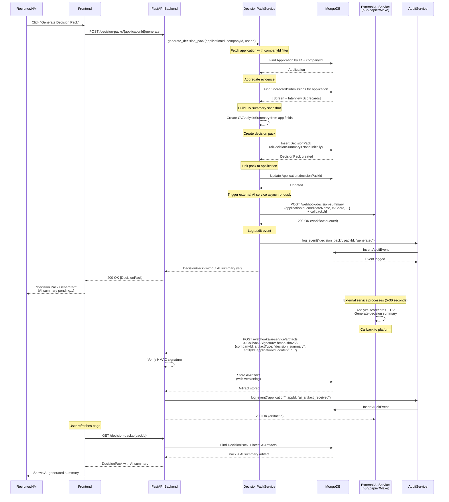
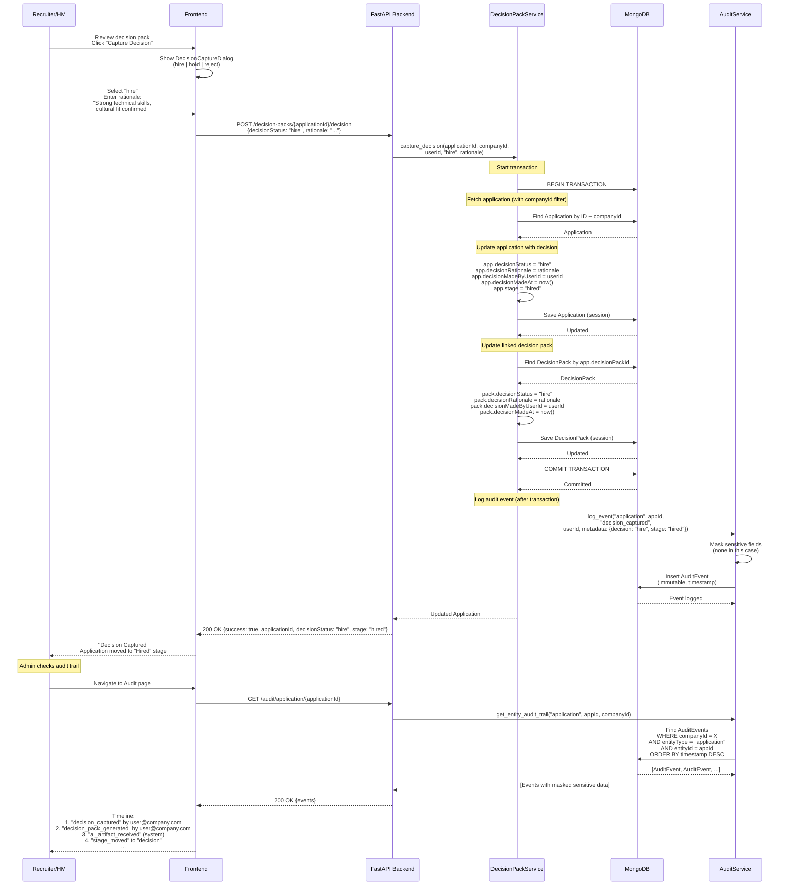
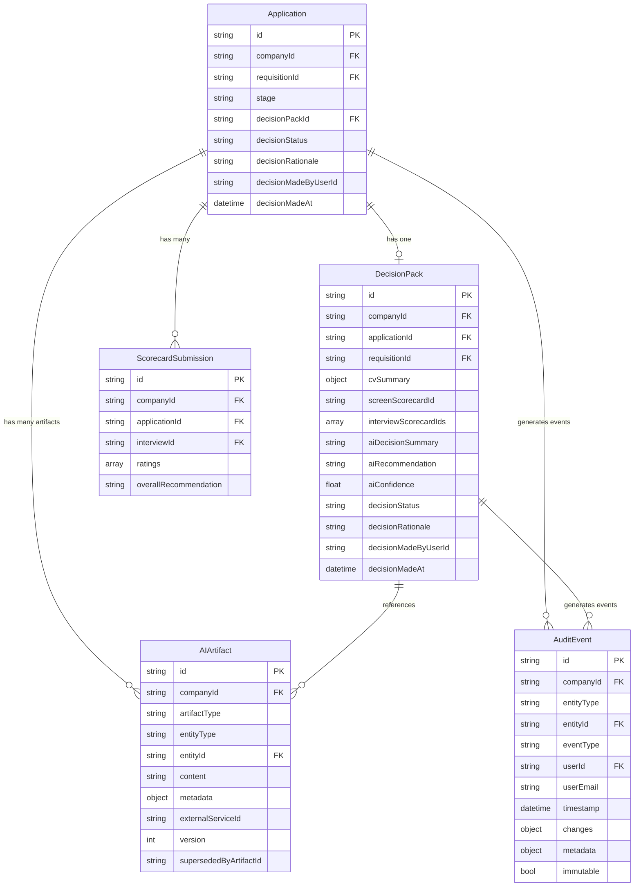
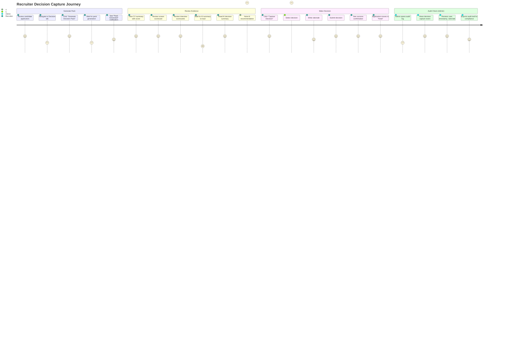

# Phase 4: Decision Packs & Integrations - Complete Workflow Diagram

## 1. DECISION PACK GENERATION + AI SUMMARY FLOW



---

## 2. DECISION CAPTURE + AUDIT FLOW



---

## 3. EXTERNAL AI SERVICE INTEGRATION (DETAILED)

```mermaid
flowchart TD
    Start([User Action:<br/>Generate Decision Pack]) --> Fetch[Fetch Application<br/>+ Scorecards]
    
    Fetch --> Aggregate[Aggregate Evidence:<br/>CV Summary<br/>Screen Scorecard<br/>Interview Scorecards]
    
    Aggregate --> CreatePack[Create DecisionPack<br/>in MongoDB]
    
    CreatePack --> PrepPayload[Prepare External<br/>Service Payload]
    
    PrepPayload --> GetConfig{Read Config<br/>from Settings}
    
    GetConfig --> BuildURL[Build URL:<br/>BASE_URL + WORKFLOW_PATH]
    
    BuildURL --> AddHeaders[Add API Headers:<br/>API_KEY_HEADER: API_KEY_VALUE]
    
    AddHeaders --> AddCallback[Add to Payload:<br/>callbackUrl<br/>companyId]
    
    AddCallback --> HTTPPost[HTTP POST to<br/>External Service]
    
    HTTPPost --> CheckResponse{Response<br/>Status?}
    
    CheckResponse -->|200 OK| LogSuccess[Log Success]
    CheckResponse -->|Error| LogFailure[Log Failure<br/>Continue anyway]
    
    LogSuccess --> ReturnPack[Return DecisionPack<br/>to User]
    LogFailure --> ReturnPack
    
    ReturnPack --> UserSees[User Sees:<br/>"Decision Pack Generated"<br/>AI summary pending...]
    
    UserSees -.->|Async| ExternalProcess
    
    subgraph ExternalProcess[External Service Processing]
        direction TB
        Queue[Workflow Queued] --> Process[Process Request:<br/>Analyze evidence<br/>Generate summary]
        Process --> GenSummary[Generate:<br/>- Decision summary<br/>- Recommendation<br/>- Confidence score]
        GenSummary --> BuildCallback[Build Callback Payload]
        BuildCallback --> SignPayload[Sign with HMAC-SHA256]
    end
    
    SignPayload --> Callback[POST to Platform Webhook:<br/>/webhooks/ai-service/artifacts]
    
    Callback --> VerifySignature{Verify<br/>Signature?}
    
    VerifySignature -->|Valid| StoreArtifact[Store AIArtifact<br/>with Versioning]
    VerifySignature -->|Invalid| Reject401[Return 401<br/>Unauthorized]
    
    StoreArtifact --> UpdatePack{DecisionPack<br/>Exists?}
    
    UpdatePack -->|Yes| LinkArtifact[Link AIArtifact<br/>to DecisionPack]
    UpdatePack -->|No| StoreOnly[Store Artifact Only]
    
    LinkArtifact --> AuditLog[Log Audit Event:<br/>ai_artifact_received]
    StoreOnly --> AuditLog
    
    AuditLog --> Return200[Return 200 OK<br/>{artifactId}]
    
    Return200 -.->|User Refreshes| Refresh[GET /decision-packs/{id}]
    
    Refresh --> ShowSummary[Show AI Summary<br/>with Recommendation]
    
    ShowSummary --> End([End])
    Reject401 --> End
    
    style Start fill:#e1f5e1
    style End fill:#ffe1e1
    style ExternalProcess fill:#e3f2fd
    style VerifySignature fill:#fff3e0
    style StoreArtifact fill:#f3e5f5
```

---

## 4. AUDIT TRAIL ARCHITECTURE

```mermaid
graph TB
    subgraph Events[Event Sources]
        E1[Application<br/>Stage Change]
        E2[Decision Pack<br/>Generated]
        E3[Decision<br/>Captured]
        E4[Requisition<br/>Approved]
        E5[Scorecard<br/>Submitted]
        E6[AI Artifact<br/>Received]
    end
    
    subgraph AuditService[Audit Service Layer]
        LogEvent[log_event&#40;&#41;]
        Mask[Mask Sensitive Fields:<br/>salary, ssn, password, etc.]
    end
    
    subgraph Database[MongoDB - audit_events]
        Store[Immutable Insert<br/>NO UPDATES ALLOWED]
        Index1[Index: companyId,<br/>entityType, entityId,<br/>timestamp]
        Index2[Index: companyId,<br/>eventType, timestamp]
        Index3[Index: companyId,<br/>userId, timestamp]
    end
    
    subgraph Queries[Query Patterns]
        Q1[Entity Audit Trail:<br/>Get all events for<br/>application_123]
        Q2[User Activity:<br/>Get all events by<br/>user_456]
        Q3[Event Type Filter:<br/>Get all<br/>decision_captured events]
    end
    
    subgraph Consumers[Audit Consumers]
        Admin[Admin Dashboard:<br/>Compliance Review]
        Export[Audit Export:<br/>CSV/PDF for regulators]
        Analytics[Analytics:<br/>Process metrics]
    end
    
    E1 --> LogEvent
    E2 --> LogEvent
    E3 --> LogEvent
    E4 --> LogEvent
    E5 --> LogEvent
    E6 --> LogEvent
    
    LogEvent --> Mask
    Mask --> Store
    
    Store --> Index1
    Store --> Index2
    Store --> Index3
    
    Index1 --> Q1
    Index2 --> Q3
    Index3 --> Q2
    
    Q1 --> Admin
    Q2 --> Admin
    Q3 --> Analytics
    
    Admin --> Export
    
    style Events fill:#e8f5e9
    style AuditService fill:#fff3e0
    style Database fill:#e3f2fd
    style Queries fill:#f3e5f5
    style Consumers fill:#fce4ec
```



---

## 5. DATA MODEL RELATIONSHIPS



---

## 6. COMPLETE END-TO-END FLOW (USER PERSPECTIVE)



---

## 7. SECURITY & COMPLIANCE CONTROLS

```mermaid
flowchart LR
    subgraph Input[External Inputs]
        User[User Request]
        Webhook[External Service<br/>Webhook]
    end
    
    subgraph Auth[Authentication Layer]
        JWT[JWT Token<br/>Verification]
        HMAC[HMAC Signature<br/>Verification]
    end
    
    subgraph RBAC[Authorization Layer]
        CheckRole{User Role?}
        Admin[Admin]
        Recruiter[Recruiter]
        HM[Hiring Manager]
        Deny[403 Forbidden]
    end
    
    subgraph Tenant[Multi-Tenancy]
        ExtractCompany[Extract companyId<br/>from JWT]
        FilterQuery[Add companyId<br/>to all queries]
        Validate{companyId<br/>matches?}
    end
    
    subgraph Privacy[Privacy Controls]
        Mask[Mask Sensitive<br/>Fields in Audit]
        Redact[Redact PII<br/>in Logs]
        Encrypt[Encrypt Secrets<br/>at Rest]
    end
    
    subgraph Audit[Audit Trail]
        LogAll[Log Every<br/>State Change]
        Immutable[Immutable<br/>Insert Only]
        Timestamp[UTC Timestamp<br/>+ User Tracking]
    end
    
    User --> JWT
    Webhook --> HMAC
    
    JWT --> CheckRole
    HMAC --> ExtractCompany
    
    CheckRole -->|admin| Admin
    CheckRole -->|recruiter| Recruiter
    CheckRole -->|hiring_manager| HM
    CheckRole -->|other| Deny
    
    Admin --> ExtractCompany
    Recruiter --> ExtractCompany
    HM --> ExtractCompany
    
    ExtractCompany --> FilterQuery
    FilterQuery --> Validate
    
    Validate -->|Yes| Mask
    Validate -->|No| Deny
    
    Mask --> Redact
    Redact --> Encrypt
    
    Encrypt --> LogAll
    LogAll --> Immutable
    Immutable --> Timestamp
    
    Timestamp --> Success[✅ Request<br/>Processed]
    
    style Input fill:#e8f5e9
    style Auth fill:#fff3e0
    style RBAC fill:#ffebee
    style Tenant fill:#e3f2fd
    style Privacy fill:#f3e5f5
    style Audit fill:#fce4ec
    style Success fill:#c8e6c9
    style Deny fill:#ffcdd2
```



---

## 8. SYSTEM COMPONENTS MAP

```mermaid
graph TD
    subgraph Frontend[Frontend - React + TypeScript]
        UI1[DecisionPackView<br/>Component]
        UI2[DecisionCaptureDialog<br/>Component]
        UI3[AuditTrailTimeline<br/>Component]
        
        API1[decisionPackService.ts]
        API2[auditService.ts]
    end
    
    subgraph Backend[Backend - FastAPI + MongoDB]
        Route1[/decision-packs/*<br/>Routes]
        Route2[/audit/*<br/>Routes]
        Route3[/webhooks/ai-service/*<br/>Routes]
        
        Svc1[DecisionPackService]
        Svc2[AuditService]
        Svc3[AIArtifactService]
        Svc4[ExternalAIService]
        
        Model1[DecisionPack<br/>Model]
        Model2[AuditEvent<br/>Model]
        Model3[AIArtifact<br/>Model]
        Model4[Application<br/>Model]
    end
    
    subgraph Database[MongoDB]
        Coll1[(decision_packs)]
        Coll2[(audit_events)]
        Coll3[(ai_artifacts)]
        Coll4[(applications)]
    end
    
    subgraph External[External Services]
        AI[n8n / Zapier / Make<br/>AI Workflows]
    end
    
    UI1 --> API1
    UI2 --> API1
    UI3 --> API2
    
    API1 --> Route1
    API2 --> Route2
    
    Route1 --> Svc1
    Route2 --> Svc2
    Route3 --> Svc3
    
    Svc1 --> Svc2
    Svc1 --> Svc3
    Svc1 --> Svc4
    
    Svc1 --> Model1
    Svc2 --> Model2
    Svc3 --> Model3
    Svc1 --> Model4
    
    Model1 --> Coll1
    Model2 --> Coll2
    Model3 --> Coll3
    Model4 --> Coll4
    
    Svc4 -.->|HTTP POST| AI
    AI -.->|Webhook Callback| Route3
    
    style Frontend fill:#e3f2fd
    style Backend fill:#fff3e0
    style Database fill:#f3e5f5
    style External fill:#e8f5e9
```

---

## Legend

**Synchronous Operations**: Solid lines (→)  
**Asynchronous Operations**: Dashed lines (-.->)  
**Database Operations**: Cylinder shapes  
**Decision Points**: Diamond shapes  
**User Interactions**: Rounded rectangles  
**External Services**: Cloud/external boxes

---

**Total Implementation**: ~1500 lines of production-ready code across 12 new files + 5 updated files
